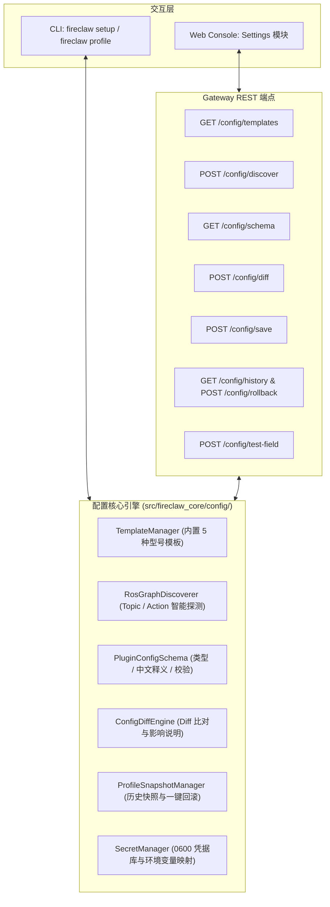

# UX-P1 零手写配置 (Zero-Handwritten Configuration) 设计方案

> 状态说明：本文是当时的设计/实施记录，不是当前产品能力声明。当前闭环边界与剩余缺口以 `memory/2026-08-19/seven-stage-ux-closure-audit.md` 及后续记录为准。

日期：2026-08-14
状态：Approved
主题：FireClaw 零手写配置系统、ROS 图谱自发现、统一 Schema 与版本回滚设计规范

---

## 1. 背景与目标

为了让操作员无需从空白 TOML 开始手写底层机器人配置，UX-P1 引入 **零手写配置引擎**：
1. **型号模板库**：按机器人型号提供开箱即用模板；
2. **ROS 自发现探针**：智能混合探测活跃 Topic、Action、Service 并自动预填；
3. **统一配置 Schema**：CLI 向导与 Web 动态表单共用一套 Schema 定义、中文帮助与校验规则；
4. **单项连通性测试**：每个关键通信项均提供一键「测试连接」与数据流探测；
5. **Diff 与影响评估**：保存前渲染两栏变更对比与物理影响说明；
6. **多版本快照与一键回滚**：自动归档历史快照，支持 CLI 与 Web 一键恢复；
7. **敏感凭据安全隔离**：明文 Token / 证书不入普通 Profile，通过环境变量或 `0600` 凭据库隔离。

---

## 2. 核心模块与架构设计

---

## 3. 详细子系统规范

### 3.1 机器人型号模板库 (`TemplateManager`)
内置 5 大预设模板（存放于 `src/fireclaw_core/config/templates/` 或模块定义）：
1. `gazebo_turtlebot3_burger`：两轮差速仿真基础型（默认激光雷达 `/scan`，里程计 `/odom`，控制 `/cmd_vel`，导航 `/move_base`）。
2. `gazebo_turtlebot3_waffle`：仿真增强型（增加相机 `/camera/rgb/image_raw`）。
3. `real_firefighting_tracked`：实机消防履带车（双目相机、热成像 `/thermal/image_raw`、有毒气体传感器 `/sensors/gas`、水炮/干粉执行器）。
4. `real_quadruped_rescue`：实机四足搜救机器狗（3D 激光雷达、全向底盘、云台控制 `/gimbal/cmd`）。
5. `real_generic_diff_drive`：实机通用差速底盘。

### 3.2 ROS 图谱自动发现探针 (`RosGraphDiscoverer`)
- **智能混合探测**：
  - 连接目标 `ROS_MASTER_URI`（默认 `http://localhost:11311`）；
  - 查询当前活跃的 Topics、Message Types、Services、Action Servers；
  - 根据特征模式（如 `sensor_msgs/LaserScan`、`nav_msgs/Odometry`、`geometry_msgs/Twist`、`move_base_msgs/MoveBaseAction`）自动匹配并预填对应字段；
  - 若 ROS Master 离线，自动使用模板默认值并提示“当前处于离线模式，已填入推荐默认值”。

### 3.3 统一配置 Schema (`PluginConfigSchema`)
定义字段规范：
- `name`：字段唯一标识（如 `laser_scan_topic`）；
- `type`：数据类型（`string`、`integer`、`float`、`boolean`、`select`）；
- `label_zh`：中文标签（如“激光雷达扫描话题”）；
- `description_zh`：中文详细解释（如“用于实时避障与建图的 2D LaserScan 消息话题”）；
- `example`：典型示例（如 `/scan` 或 `/robot/laser`）；
- `default`：默认值；
- `required`：是否必填；
- `secret`：是否为敏感凭据（为 true 时禁止明文写入 Profile）；
- `test_probe`：关联的测试探测方法（如 `probe_topic_stream`）。

### 3.4 配置变更 Diff 与影响评估 (`ConfigDiffEngine`)
在保存或覆盖前输出结构化变更评估：
- **两栏对比**：旧值 vs 新值；
- **影响分析规则表**：
  - 修改 `move_base_action` -> *“影响 Navigation Plugin 导航动作下发，请确保该 Action Server 正在运行。”*
  - 修改 `thermal_camera_topic` -> *“影响火源感知 Plugin，若话题无数据将导致热成像不可用。”*
  - 切换 `mode` (`simulation` -> `real`) -> *“高风险变更：切换为真实机器人，启动前将强制执行实机硬件安全预检。”*

### 3.5 多版本快照与一键回滚 (`ProfileSnapshotManager`)
- 存储路径：`~/.fireclaw/profiles/.history/<profile_name>/`；
- 快照命名：`<profile_name>.<YYYYMMDD_HHMMSS>.<hash8>.toml`；
- 保留策略：滚动保留最新 20 份快照；
- 操作：
  - CLI：`fireclaw profile history`、`fireclaw profile rollback [snapshot_id]`；
  - Web Console：Settings 页面下拉选择历史快照并点击「回滚此配置」。

### 3.6 敏感凭据安全隔离 (`SecretManager`)
- Profile 仅记录环境变量名（如 `api_key_env = "OPENAI_API_KEY"`）或占位引用；
- 真实凭据保存在用户私有文件 `~/.fireclaw/credentials.json`（权限 `0600`，目录 `0700`），绝不混入可分发的普通 Profile。

---

## 4. API 契约与接口定义

1. `GET /config/templates` -> `{"templates": [{"id": "...", "name_zh": "...", "mode": "...", "description": "..."}]}`
2. `POST /config/discover` -> `{"detected": true, "topics": [...], "suggested_mappings": {...}}`
3. `GET /config/schema` -> `{"fields": [...]}`
4. `POST /config/diff` -> `{"diff_lines": [...], "impact_analysis": [...]}`
5. `POST /config/save` -> `{"status": "saved", "snapshot_id": "...", "profile_path": "..."}`
6. `GET /config/history` -> `{"snapshots": [{"id": "...", "timestamp": "...", "summary": "..."}]}`
7. `POST /config/rollback` -> `{"status": "rolled_back", "current_snapshot_id": "..."}`
8. `POST /config/test-field` -> `{"field": "...", "status": "ok"|"error", "latency_ms": 12, "details": "..."}`

---

## 5. 测试与验证策略

1. **单元与引擎测试 (`tests/test_config_engine.py`)**：
   - 模板加载与字段完整性；
   - ROS 图谱自发现模式匹配（带模拟 ROS Graph）；
   - Diff 引擎与影响评估规则准确性；
   - 快照滚动与一键回滚；
   - 凭据隔离与 0600 权限。
2. **Web 与 CLI 集成测试 (`tests/test_config_cli_and_web.py`)**：
   - CLI `fireclaw profile history` / `rollback` / `diff` 交互；
   - Web API 端点测试；
   - Web 控制台 Settings 页面动态表单渲染与连通性测试。
3. **全量回归测试**：全仓 >2200 pytest 测试保持 100% 通过。
